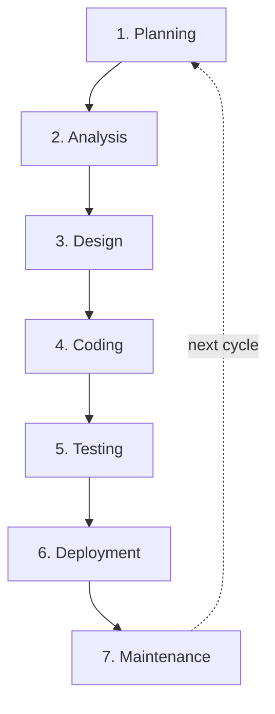

# Software Development Lifecycle (SDLC)

The software development lifecycle, or SDLC, is a structured way to plan, build, release, and maintain software. Its value is not in enforcing a single process, but in giving teams a repeatable frame for turning an idea into a working system while managing scope, quality, cost, risk, and communication.

In practice, the SDLC breaks software work into a set of phases with clear goals and handoffs. Different methodologies arrange those phases differently. Some treat them as mostly sequential. Others run them in short loops with frequent feedback.

## Why teams use an SDLC

An SDLC gives teams a common map for:

- clarifying what is being built and why
- defining requirements before implementation gets expensive
- aligning technical work with stakeholder expectations
- making trade-offs around scope, time, budget, and risk visible
- improving documentation, coordination, and transparency
- creating a basis for quality assurance and ongoing maintenance

Without that structure, projects tend to drift. Requirements become fuzzy, testing happens too late, and teams discover important constraints only after significant work has already been done.

## The seven commonly cited phases

Many descriptions of the SDLC use seven broad phases. Teams may combine them, repeat them, or overlap them, but the underlying concerns are usually the same.

### 1. Planning

Planning sets the direction for the work. The team defines the problem, the intended users, the business goal, and the boundaries of the project.

Typical questions include:

- What problem are we solving?
- Who will use the system?
- What outcomes matter most?
- What is explicitly out of scope?
- What resources, timelines, and risks should be anticipated early?

This phase often produces an initial requirements or project brief that captures goals, constraints, and a rough timeline.

### 2. Analysis

Analysis turns a high-level idea into a concrete understanding of what the software must do. The team gathers functional requirements, technical constraints, compliance needs, and feasibility signals.

Common activities include:

- collecting user and stakeholder requirements
- evaluating feasibility and dependencies
- examining existing systems and operational constraints
- identifying security, regulatory, and organizational requirements
- clarifying acceptance criteria and task boundaries

The main outcome is a clearer view of scope and a shared understanding of the work to be implemented.

### 3. Design

Design answers the question, "How should this system be built?" This includes architecture, data structures, interfaces, workflows, security considerations, and system boundaries.

A design phase may cover:

- application architecture
- UI and navigation flows
- database or storage design
- integration points with other systems
- security design and threat modeling
- modularization and service boundaries

Teams may also build early prototypes here to test assumptions before full implementation begins.

### 4. Development

Development is where the software is actually built. Engineers use the outputs of planning, analysis, and design to implement features, supporting services, interfaces, and internal tooling.

This phase often includes:

- writing application code
- creating APIs and supporting components
- breaking work into implementation tasks
- performing reviews during development
- running early checks to catch defects before later stages

Modern teams increasingly use AI tools during development for prototyping, code generation, and debugging support, but those outputs still require review and validation.

### 5. Testing

Testing verifies that the system behaves as intended and that it meets both user needs and technical expectations. It also helps expose security and performance issues before release.

Testing may include:

- unit tests
- integration tests
- system tests
- acceptance tests
- security checks
- manual exploratory testing
- automated regression coverage

Testing is often iterative rather than one-and-done. Teams test, fix issues, and test again.

### 6. Deployment

Deployment moves the software into an environment where users can access it. A release is not just a technical event; it also includes operational readiness and user enablement.

That can involve:

- staged or phased rollout
- beta releases
- training and documentation
- release coordination
- monitoring initial production behavior

A successful deployment minimizes disruption while making the software usable in real conditions.

### 7. Maintenance

Maintenance continues after release. Software needs fixes, updates, performance improvements, security patches, and support for new use cases as the surrounding environment changes.

Maintenance commonly includes:

- bug fixes
- patching vulnerabilities
- optimization and tuning
- adapting to new requirements
- supporting users after release

In modern delivery models, maintenance is not a separate afterthought. It is part of the normal operating rhythm of the product.

## Agile as an SDLC style

The SDLC is a framework, not a single operating model. Agile is one way to run that framework. Instead of moving through planning, analysis, design, development, testing, deployment, and maintenance once in a mostly linear sequence, agile revisits those concerns in short, repeatable loops.

That shift changes the rhythm of delivery:

- planning happens at multiple levels, from roadmap work to short iteration planning
- analysis and design continue throughout delivery instead of ending before coding starts
- testing happens continuously rather than being reserved for the end
- deployment becomes incremental, with smaller releases and faster feedback
- maintenance work flows back into the backlog instead of living in a separate lane forever

Agile is especially useful when requirements are likely to change, when stakeholder feedback is available during delivery, and when teams want to reduce the risk of building the wrong thing for too long.

## Lean inside agile

Lean fits naturally alongside agile because both emphasize learning quickly, improving flow, and reducing work that does not create value. In software, lean is less about manufacturing language and more about disciplined attention to waste, delay, and quality.

In practice, lean thinking inside an agile system usually means:

- keeping work in small batches so teams can learn faster
- reducing waiting time, handoffs, and partially finished work
- building quality into the process instead of depending on late inspection
- using real feedback to guide decisions instead of over-planning far ahead
- improving the delivery system continuously, not just the product itself

Lean is useful as a counterweight to ceremony-heavy agile. It asks whether a process step is actually helping the team deliver value, or whether it only creates motion without progress.

## Scrum

Scrum is a structured agile framework built around time-boxed sprints. The basic idea is simple: select a small, high-priority slice of work, complete it within a fixed period, inspect the result, and adapt based on what was learned.

Common Scrum elements include:

- a product backlog that represents the ordered body of work
- sprint planning to define the near-term goal and select backlog items
- a daily check-in to surface progress and blockers
- a sprint review to inspect the increment with stakeholders
- a retrospective to improve how the team works

Scrum works best when a team benefits from a strong cadence, explicit commitments, and regular checkpoints for inspection and adaptation. It is often helpful for product teams building new capabilities in small increments.

Scrum can fail when teams mistake the framework for the outcome. Running the meetings is not the same as delivering a usable increment. Weak backlog management, unclear sprint goals, and constant interruption can make Scrum feel rigid without producing the benefits of focus.

## Kanban

Kanban is another agile approach, but it favors continuous flow over time-boxed sprints. Work is visualized on a board, moves across clearly defined stages, and is constrained by work-in-progress limits so bottlenecks become visible early.

Core Kanban ideas include:

- make the workflow visible
- limit work in progress
- manage and measure flow
- reduce bottlenecks and waiting time
- improve policies and process incrementally

Kanban is often a good fit when work arrives continuously, priorities change often, or the team handles a mix of planned feature work, maintenance, support, and operational tasks. It gives teams a way to improve throughput without forcing everything into sprint boundaries.

## Scrum and Kanban in practice

Scrum and Kanban are often presented as alternatives, but many teams blend them. A team may use sprint planning and retrospectives from Scrum while also using Kanban-style work-in-progress limits and flow metrics to keep the system healthy.

As a rough guide:

- Scrum is useful when the team wants a predictable planning cadence and a shared sprint goal
- Kanban is useful when the team needs flexibility and continuous intake management
- a hybrid approach is useful when the team wants both regular planning rhythm and tighter flow control

The more important decision is not which label a team uses, but whether the chosen system makes work visible, limits overload, supports feedback, and regularly produces working software.

## Agile benefits and failure modes

When agile is working well, it tends to improve:

- feedback speed
- ability to reprioritize
- visibility into progress
- alignment between team and stakeholders
- confidence that the team is building the right thing

When agile is working poorly, the failure modes are also predictable:

- work is started faster than it is finished
- sprint commitments become theater rather than useful planning tools
- teams hold ceremonies without learning from them
- the backlog becomes a dumping ground instead of a decision-making tool
- maintenance and defects are treated as interruptions instead of part of the delivery system

## Takeaway

The SDLC remains the high-level frame: software still needs to be planned, understood, designed, built, tested, released, and maintained. Agile changes how those concerns are managed. Instead of treating them as one-way handoffs, it turns them into short feedback-driven loops.

Within that agile view, lean helps teams reduce waste and improve flow, Scrum provides a structured sprint cadence, and Kanban provides a flow-based system for managing work continuously. For teams using coding agents, that matters because speed is only useful when the surrounding workflow still protects clarity, focus, review quality, and learning.
