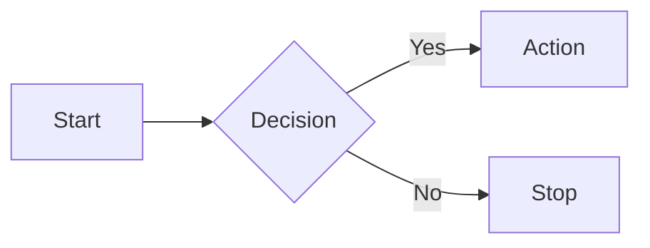
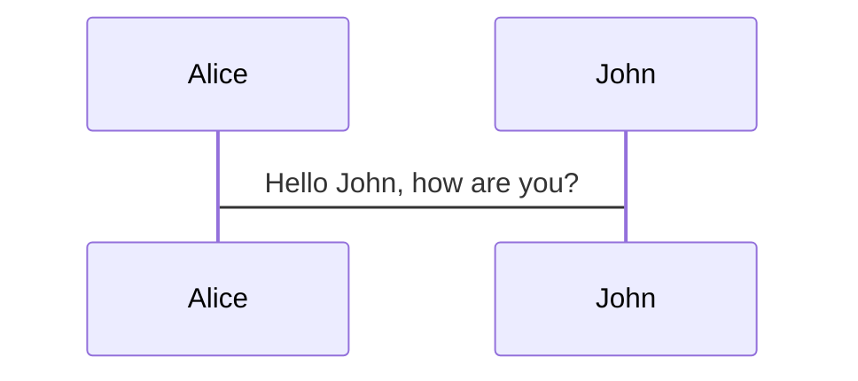
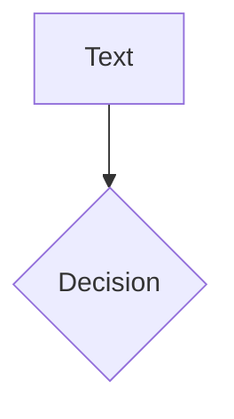
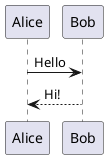

# Slidev Syntax Reference

Complete reference for Slidev markdown syntax. Consult this when generating slides.

## Table of Contents

1. [File Structure & Headmatter](#file-structure--headmatter)
2. [Multi-File Presentations](#multi-file-presentations)
3. [Per-Slide Frontmatter](#per-slide-frontmatter)
4. [MDC / Comark Syntax](#mdc--comark-syntax)
5. [Images](#images)
6. [Built-in Layouts](#built-in-layouts)
7. [Code Blocks](#code-blocks)
8. [Click Animations](#click-animations)
9. [Slide Transitions](#slide-transitions)
10. [Diagrams](#diagrams)
11. [LaTeX Math](#latex-math)
12. [Speaker Notes](#speaker-notes)
13. [Styling](#styling)
14. [Themes](#themes)

---

## File Structure & Headmatter

The first YAML block in `slides.md` configures the entire presentation:

```yaml
---
theme: default
title: My Presentation
info: |
  ## My Presentation
  A brief description of what this talk covers.
author: Jane Doe
class: default
transition: slide-left
mdc: true
drawings:
  persist: false
exportFilename: my-presentation
duration: 20min
colorSchema: auto
aspectRatio: 16/9
fonts:
  sans: Inter
  mono: Fira Code
defaults:
  layout: default
---
```

**Key headmatter fields:**
- `theme` — Theme ID (e.g., `default`, `seriph`, `apple-basic`, `dracula`)
- `title` — Presentation title (browser tab and exports)
- `info` — Multiline description using `info: |` YAML syntax
- `author` — Author name (PDF/PPTX metadata)
- `class` — Global CSS classes applied to all slides
- `transition` — Default slide transition (see Transitions section)
- `mdc: true` — Enables MDC/Comark syntax for inline attributes on images, links, etc. Use `comark: true` on Slidev v52+.
- `drawings` — Drawing config (`persist: false` to not save drawings)
- `exportFilename` — Filename for PDF/PPTX export (kebab-case)
- `duration` — Presentation duration (e.g., `20min`, `1h`)
- `colorSchema` — Force `light`, `dark`, or `auto`
- `aspectRatio` — Slide aspect ratio (default `16/9`)
- `canvasWidth` — Canvas width in pixels
- `lineNumbers` — Show line numbers in code blocks globally
- `fonts` — Font families (`sans`, `serif`, `mono` — auto-imported from Google Fonts)
- `defaults` — Default frontmatter applied to all slides
- `themeConfig` — Theme-specific customization (e.g., `primary: '#5d8392'`)

## Multi-File Presentations

For longer presentations (15+ slides or distinct topic sections), split into multiple files using `src:` imports:

```yaml
---
src: ./pages/section-name.md
---
```

**How it works:**
- The main `slides.md` contains intro/agenda/closing slides inline, and imports sections
- Page files start directly with content — no leading `---` separator needed
- Each page file has its own slide separators (`---`) and per-slide frontmatter
- Image paths from page files use relative paths: `../images/filename.png`
- Name page files with kebab-case: `debug-builds.md`, `beta-builds.md`

**Example main slides.md:**
```markdown
---
theme: default
title: My Talk
mdc: true
---

# My Talk
Introduction text

---

# Agenda

- Topic A
- Topic B

---
src: ./pages/topic-a.md
---

---
src: ./pages/topic-b.md
---

---
layout: center
---

# Thank You
```

## Per-Slide Frontmatter

Each slide can have its own YAML frontmatter after a `---` separator:

```yaml
---
layout: two-cols
layoutClass: gap-16
transition: fade
class: text-center
clicks: 5
hideInToc: true
---
```

**Per-slide fields:**
- `layout` — Which layout to use for this slide
- `layoutClass` — Additional CSS classes for the layout wrapper (e.g., `gap-16`)
- `transition` — Override transition for this slide
- `class` — CSS classes to add to the slide
- `clicks` — Total click steps before auto-advancing
- `disabled` — Skip this slide
- `hideInToc` — Hide from table of contents
- `level` — Heading level for ToC nesting (1-5)
- `background` — Background image URL
- `preload` — Preload next slides (boolean)

## MDC / Comark Syntax

Enabled by `mdc: true` (or `comark: true` on Slidev v52+) in headmatter. Allows adding inline HTML attributes to markdown elements.

### Images with inline attributes
```markdown
{width=70% style="display: block; margin: auto;"}
```

### Links with inline attributes
Commonly used to position reference links at the bottom-right corner:
```markdown
[Reference Link](https://example.com){style="bottom: 20px; right: 20px; position: absolute"}
```

### Blockquotes with inline attributes
```markdown
> A key definition or quote{style="width: 600px"}
```

Attributes map directly to HTML attributes. Requires `mdc: true` or `comark: true` in headmatter.

## Images

### Local images convention
Store images in `./images/` directory. From page files (in `pages/`), use `../images/`.

### Centering an image
```markdown
{width=70% style="display: block; margin: auto;"}
```

### Float-right (beside text or code)
```markdown
{width=20% style="display: block; float: right; margin: auto;"}
```

### Pixel sizing
```markdown
{width=800px style="display: block; margin: auto;"}
```

### Side-by-side images (grid)
```markdown
<div class="grid grid-cols-2 gap-4">


</div>
```

All inline attribute patterns require `mdc: true` or `comark: true` in headmatter.

## Built-in Layouts

### cover
The title/cover slide. Typically first slide.
```yaml
---
layout: cover
---
# Presentation Title
Subtitle text
```

### default
Standard content slide. Used when no layout is specified.

### center
Centers content vertically and horizontally. Great for key statements and closing slides.
```yaml
---
layout: center
---
# The Big Idea
```

### section
Section divider. Marks the start of a new topic.
```yaml
---
layout: section
---
# Part 2: Architecture
```

### two-cols
Two-column layout. Use `::right::` to separate left and right content.
```yaml
---
layout: two-cols
---
# Left Column
Content here

::right::

# Right Column
Content here
```

### two-cols-header
Full-width header with two columns below. Use `::left::` and `::right::`.
```yaml
---
layout: two-cols-header
---
# Header spanning both columns

::left::
Left content

::right::
Right content
```

### image-right
Image on the right, content on the left.
```yaml
---
layout: image-right
image: /path/to/image.png
---
# Content on left
```

### image-left
Image on the left, content on the right.
```yaml
---
layout: image-left
image: /path/to/image.png
---
# Content on right
```

### image
Full-slide background image.
```yaml
---
layout: image
image: /path/to/image.png
backgroundSize: cover
---
```

### quote
Styled quotation.
```yaml
---
layout: quote
---
"Any sufficiently advanced technology is indistinguishable from magic."

-- Arthur C. Clarke
```

### fact
Emphasize a statistic or key fact.
```yaml
---
layout: fact
---
# 99.99%
Uptime SLA achieved in Q4
```

### statement
Bold assertion or key message.
```yaml
---
layout: statement
---
# We need to rethink our approach
```

### intro
Introduction slide with title, description, and author.

### iframe / iframe-left / iframe-right
Embed a webpage. Use `url` prop.
```yaml
---
layout: iframe-right
url: https://example.com
---
# Commentary here
```

### full
Uses entire screen area without padding.

### none
Blank canvas -- no default styling.

### end
Final slide of the presentation.
```yaml
---
layout: end
---
# Thank You!
Questions?
```

## Code Blocks

### Basic syntax highlighting
````markdown
```python
def hello():
    print("Hello, World!")
```
````

### Line highlighting
Highlight specific lines to draw attention:
````markdown
```python {2,3}
def hello():
    name = "World"
    print(f"Hello, {name}!")
```
````

Line ranges: `{1-3}`, specific lines: `{1,3,5}`, combined: `{1-3,5}`.

### Line highlighting with clicks (walkthrough pattern)
Use `*` or `all` to show all lines, and `|` to separate click steps:
````markdown
```ts {*|2-4|8-10|11|*}
// Click 1: all lines visible (context)
// Click 2: lines 2-4 highlighted
// Click 3: lines 8-10 highlighted
// Click 4: line 11 highlighted
// Click 5: all lines visible again
```
````

This is the idiomatic pattern for code walkthroughs: show full context first, zoom into sections on each click, then return to the full view.

### Filename labels
Add a display filename to code blocks:
````markdown
```ts [server.ts] {all|4|6-7|all}
import express from 'express'
const app = express()
```
````

### Diff blocks
Use `diff` language to show code changes:
````markdown
```diff
-    return device.isSimulator
+    return false
```
````

### Line numbers
````markdown
```python {lines:true}
def hello():
    print("Hello!")
```
````

### Max height (scrollable)
````markdown
```python {maxHeight:'200px'}
# Long code block that becomes scrollable
```
````

### Import code from file
````markdown
<<< @/snippets/example.py
````

With line highlighting:
````markdown
<<< @/snippets/example.py {2,3}
````

### Monaco Editor (interactive)
````markdown
```python {monaco}
# Editable code block
x = 42
```
````

### Code groups (tabs)
````markdown
:::code-group

```bash [npm]
npm install slidev
```

```bash [pnpm]
pnpm add slidev
```

:::
````

### Shiki Magic Move
Animate between multiple code blocks to show code evolution:
`````markdown
````md magic-move {lines: true}
```ts {*|2|*}
// step 1
const author = reactive({
  name: 'John Doe',
})
```

```ts {*|1-2|3-4}
// step 2
export default {
  data() {
    return { author: { name: 'John Doe' } }
  }
}
```
````
`````

## Click Animations

### v-click (reveal on click)
```markdown
<v-click>

This appears after one click.

</v-click>
```

### v-clicks (reveal list items one by one)
```markdown
<v-clicks>

- First item (click 1)
- Second item (click 2)
- Third item (click 3)

</v-clicks>
```

### v-click with depth for nested lists
```markdown
<v-clicks depth="2">

- Parent item
  - Child 1
  - Child 2
- Another parent

</v-clicks>
```

### Hide on click
```markdown
<div v-click.hide>

This disappears after a click.

</div>
```

### Show at specific click number
```markdown
<div v-click="3">

Visible after click 3.

</div>
```

### Click range (show then hide)
```markdown
<div v-click="[2, 4]">

Visible at clicks 2-3, hidden at click 4.

</div>
```

### v-after (same timing as previous v-click)
```markdown
<div v-click>Hello</div>
<div v-after>World</div>
```
Both "Hello" and "World" appear on the same click.

## Slide Transitions

Set globally in headmatter or per-slide in frontmatter.

### Built-in transitions
- `fade` -- Crossfade
- `fade-out` -- Fade out then fade in
- `slide-left` -- Slide from right to left
- `slide-right` -- Slide from left to right
- `slide-up` -- Slide from bottom to top
- `slide-down` -- Slide from top to bottom
- `view-transition` -- Modern View Transitions API

### Per-slide override
```yaml
---
transition: fade
---
```

### Different forward/backward transitions
```yaml
---
transition: slide-left | slide-right
---
```

## Diagrams

### Mermaid
````markdown

````

With options (scaling, alt text, theme):
````markdown

````

````markdown

````

Supports: flowcharts, sequence diagrams, class diagrams, state diagrams, ER diagrams, Gantt charts, pie charts, mindmaps, and more.

### PlantUML
````markdown

````

## LaTeX Math

### Inline math
```markdown
The formula $E = mc^2$ is well known.
```

### Block math
```markdown
$$
\int_0^\infty e^{-x^2} dx = \frac{\sqrt{\pi}}{2}
$$
```

Rendered via KaTeX.

## Speaker Notes

Add notes at the END of each slide using HTML comments:

```markdown
# My Slide Title

Content here

<!--
These are speaker notes.
- They support **markdown** formatting
- Visible in presenter mode (press P)
- Not visible in the main presentation view

[Pacing: 3:00] Emphasize the key point here.
-->
```

The comment must be the LAST element on the slide. Comments placed elsewhere are ignored as notes.

Notes can sync with clicks:
```markdown
<!--
[click] This appears after the first click
[click] This after the second
[click:3] Skip ahead to click 3
-->
```

## Styling

### UnoCSS utility classes
Slidev includes UnoCSS. Use utility classes directly:
```markdown
<div class="text-2xl font-bold text-blue-500 mt-4">
  Styled text
</div>
```

### Grid layouts
Create multi-column layouts with UnoCSS grid utilities:
```markdown
<div class="grid grid-cols-2 gap-4">


</div>
```

UnoCSS attribute shorthand:
```markdown
<div grid="~ cols-2 gap-4">
  content
</div>
```

Common patterns: `grid-cols-2`, `grid-cols-3`, `grid-cols-4` with `gap-4` or `gap-5`.

### Scoped styles per slide
```markdown
# My Slide

<style>
h1 {
  color: #2B90B6;
}
</style>
```

### Global styles
Create `style.css` in the project root or use the `css` config in headmatter.

## Themes

### Popular themes
- `default` -- Clean and minimal
- `seriph` -- Elegant serif typography (Slidev's default starter theme)
- `apple-basic` -- Apple keynote inspired
- `dracula` -- Dark theme with Dracula colors
- `penguin` -- Playful and colorful
- `bricks` -- Bold geometric design

### Using a theme
```yaml
---
theme: seriph
---
```

### Theme configuration
Some themes accept config via `themeConfig`:
```yaml
---
theme: seriph
themeConfig:
  primary: '#5d8392'
---
```

Install community themes: `npm install slidev-theme-<name>`.
